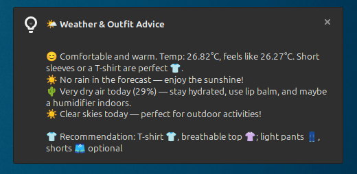
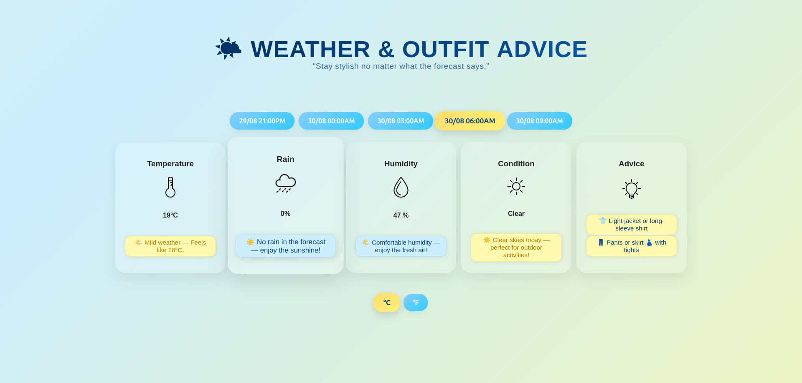
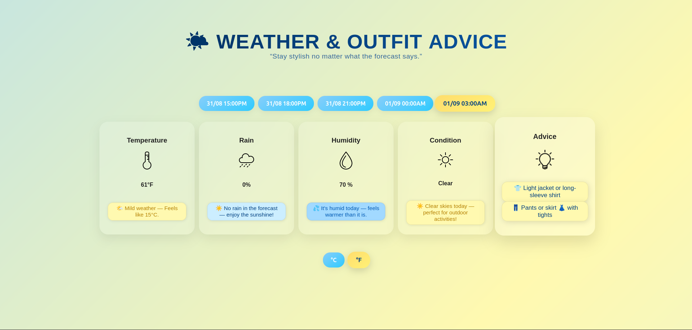

# 🌦️ Weather Outfit Recommender

A Python app that fetches 3-hour weather forecasts using the OpenWeatherMap API and recommends outfits and precautions based on **temperature**, **rain**, and **humidity** levels. With **desktop notifications** on Linux and **web interface**.

---

## 🧠 What It Does

- Fetches weather forecasts from OpenWeatherMap every 3 hours
- Saves raw data to `weather_data.json` for logging
- Stores and manages data in a local database for analysis
- Provides detailed outfit suggestions based on:
  - Temperature and “feels like” values
  - Rain amount
  - Humidity levels
  - Current weather condition (Clear, Clouds, Rain, Snow, etc.)
- Prints helpful suggestions like:
  - Whether to bring an umbrella
  - When to stay indoors due to high heat or humidity
- Sends **desktop notifications** with your weather and outfit advice
- Automatic periodic reminders every 3 hours
- **Web interface** for browsing hourly forecasts, outfit suggestions, and weather data
- **Interactive weather cards** with clickable hourly buttons
- **Unit toggling** between Celsius and Fahrenheit on the web app
- **Error handling page** if weather data fails to fetch

---

## 🖼️ Screenshots






---

## 🛠️ Tech Stack

- Python
- JavaScript
- Flask
- `requests`
- `json`
- `sqlite3`
- `plyer/notification`
- OpenWeatherMap API

---

## 🚀 How to Run

### 1. Clone the repo

```bash
git clone https://github.com/stevenmicevski/Weather-Outfit-Recommender.git
cd Weather-Outfit-Recommender
```

### 2. Replace the needed values

- Replace the *city* variable with the name of your City
- Replace the *unit* variable with your desired unit
- Replace the *api_key* variable with your OpenWeatherMap API key

### 3. Run the app

```bash
python weather.py
```

---

## 💡 Coming Soon

- Geolocation support
- Historical weather analytics and trends
